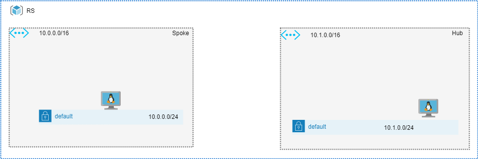
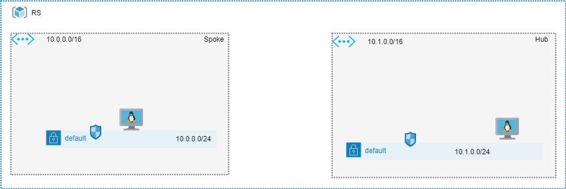
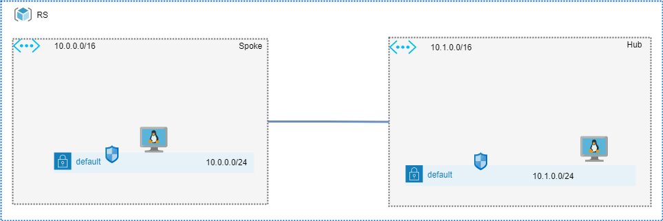
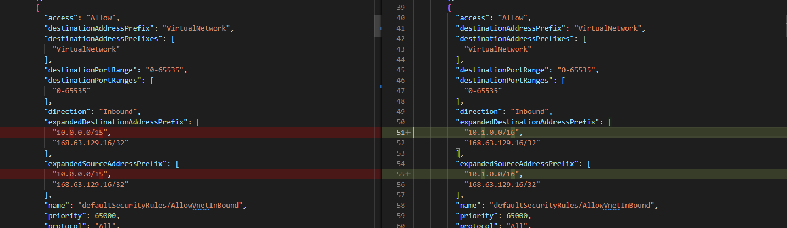
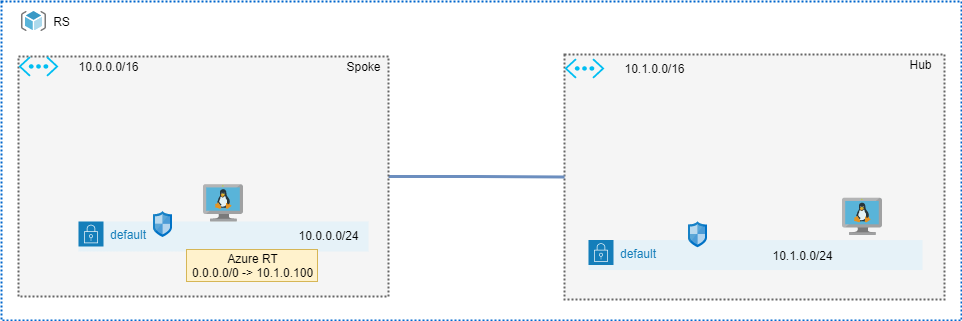
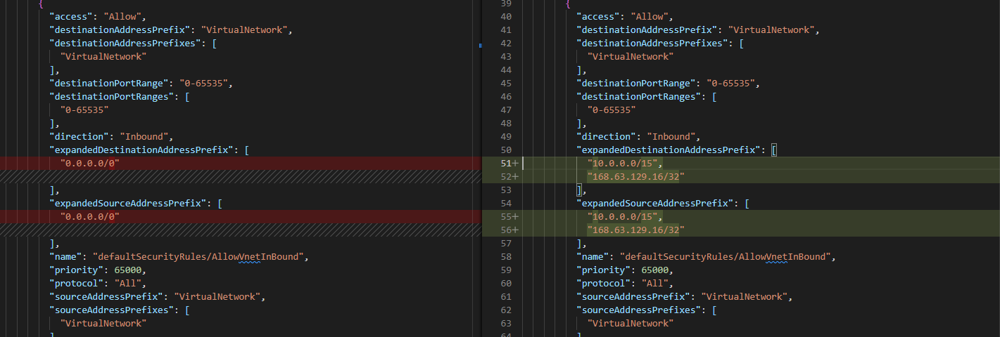
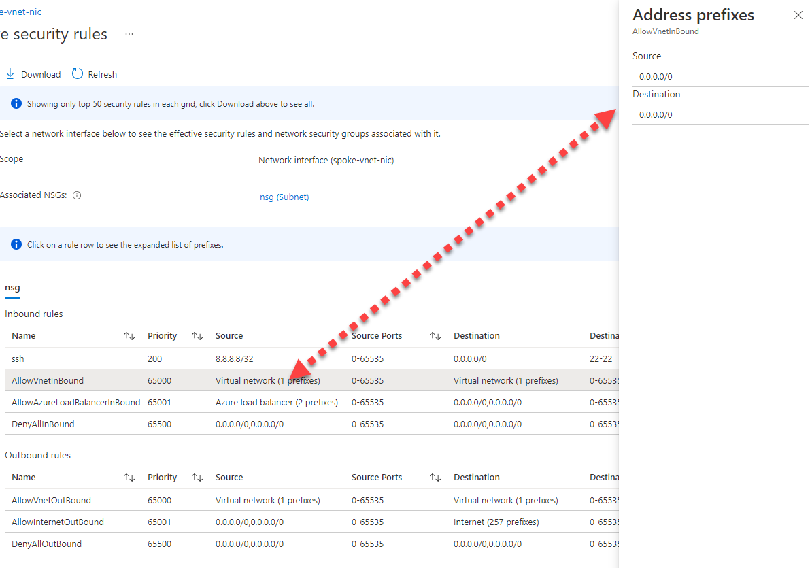
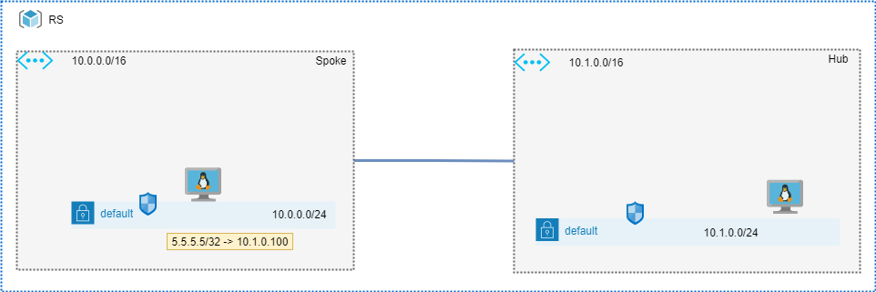
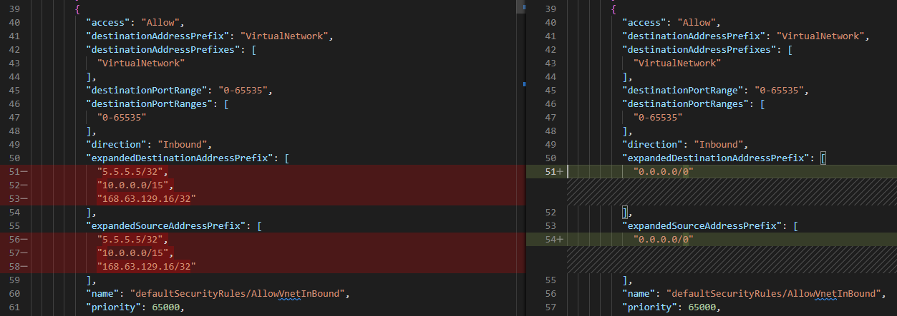
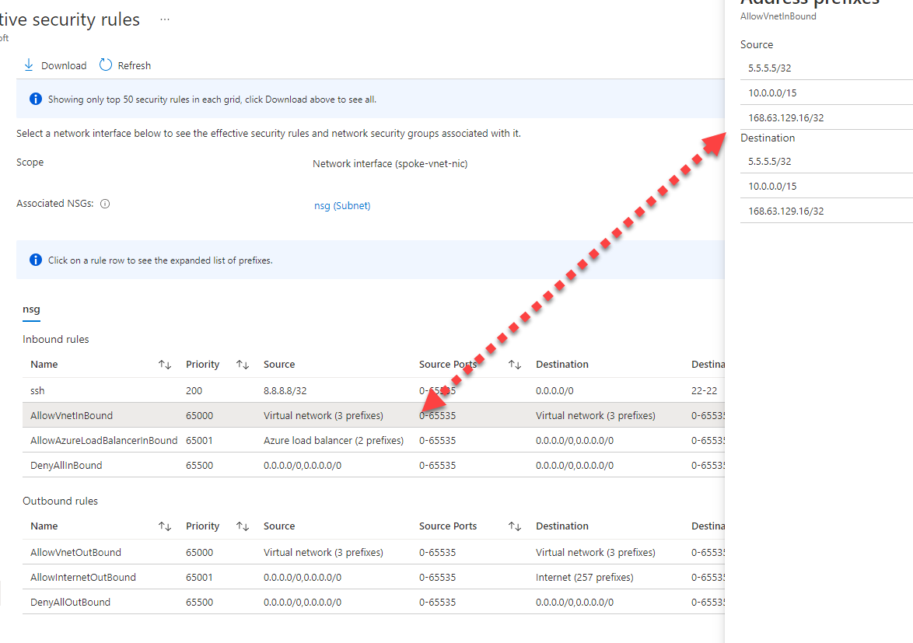

# Behavior of Azure Network Security Groups when (Default) Route is present

## Summary

The following document describes how Azure Network Security Groups behave in different scenarios.

- [Behavior of Azure Network Security Groups when (Default) Route is present](#behavior-of-azure-network-security-groups-when-default-route-is-present)
  - [Summary](#summary)
  - [Overview](#overview)
  - [Lab Scenarios](#lab-scenarios)
    - [Standalone VNET without NSGs](#standalone-vnet-without-nsgs)
      - [Topology](#topology)
      - [Observations](#observations)
    - [Standalone VNET with NSG](#standalone-vnet-with-nsg)
      - [Topology](#topology-1)
      - [Observations](#observations-1)
    - [NSG in Peered VNETs](#nsg-in-peered-vnets)
      - [Topology](#topology-2)
      - [Observations](#observations-2)
    - [NSG in presence of default route](#nsg-in-presence-of-default-route)
      - [Topology](#topology-3)
      - [Observations](#observations-3)
    - [NSG in presence of specific route](#nsg-in-presence-of-specific-route)
      - [Topology](#topology-4)
      - [Observations](#observations-4)

## Overview

There are significant differences in the behavior of Network Security Group in scenarios where Default Route is present. The change in behavior must be carefully considered in topologies like hub-and-spoke with decentralized control or VNET peering with an untrusted remote party. 

## Lab Scenarios

### Standalone VNET without NSGs
In the scenario 0 , we will examine the deployment of standalone VNETs with one subnet per VNET and one Virtual Machine. 
Script active_nsg collects active network security rules from the virtual machine's NIC. 

#### Topology



#### Observations

As expected, if no NSG is applied to the NIC nor to the Subnet, the NSGs are not installed. The output collected can be found in the [scenario0](output/scenario0) folder.

```JSON
{
  "nextLink": null,
  "value": []
}
```

### Standalone VNET with NSG

In the second case, both VNETs will have the NSG attached to their default subnet. 
Script active_nsg collects active network security rules from the virtual machine's NIC. 

It can be done by uncommenting nsg_id in the vnet_module

```
  nsg_ids = {
    # "default" = module.nsg.network_security_group_id 
  }
```

#### Topology



#### Observations

Active Security Rules matches to the Security Rules defined.

Full output can be found [here](output/scenario1/hub-vnet-vm)

### NSG in Peered VNETs
By adding VNET peering between two VNETs, the topology is expanded. The count in vnet-peering.tf can be changed to 1 for this purpose

```
module "vnet-peering" {

    count = 1
```

#### Topology


#### Observations

The VirtualNetwork tag gets changed immediately and NSG rules for ingress and egress contains not only local but remote address space as well.  It is imperative to note that this change has an impact on the NSG's behavior. When peering is created between a Remote VNET and a Local VNET, that Remote VNET's address space becomes implicitly trusted. 



### NSG in presence of default route

By attaching the route table with Default Route to the default subnet of spoke VNET, the topology is further expanded. It can be done by changing count to 1 in azurerm_subnet_route_table_association.

```
resource "azurerm_subnet_route_table_association" "RTASSOCIATION" {
  count = 1
  subnet_id      = module.vnet[1].vnet_subnets[0]
  route_table_id = azurerm_route_table.RT.id
}
```

#### Topology



#### Observations

A new VirtualNetwork tag is now applied and the NSG rules permit complete access to the virtual network.  The situation is clearly unexpected, and before implementing any solution it should be carefully reviewed with the security team. 


Portal view:


### NSG in presence of specific route

Modifying the default route to be more specific can be done by changing azurerm_route_table/route/address_prefix to something more specific. 

```
resource "azurerm_route_table" "RT" {
  name                          = "RT"
  location                      = var.location
  resource_group_name           = var.resource_group_name
  disable_bgp_route_propagation = false

  route {
    name           = "route1"
    address_prefix = "5.5.5.5/32"
    next_hop_type  = "VirtualAppliance"
    next_hop_in_ip_address = "10.1.0.100"
  }
}
```

#### Topology



#### Observations

Specific routes introduce more predictable behavior than default routes. But the remote subnet still added to the VirtualNetwork tag



